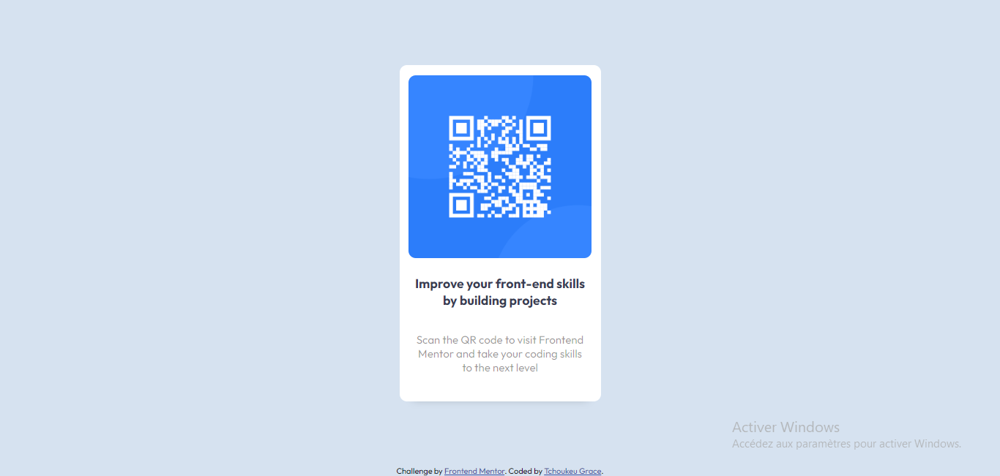

# Frontend Mentor - QR code component solution

This is a solution to the [QR code component challenge on Frontend Mentor](https://www.frontendmentor.io/challenges/qr-code-component-iux_sIO_H). Frontend Mentor challenges help you improve your coding skills by building realistic projects. 

## Table of contents

- [Overview](#overview)
  - [Screenshot](#screenshot)
  - [Links](#links)
- [My process](#my-process)
  - [Built with](#built-with)
  - [What I learned](#what-i-learned)
- [Author](#author)


## Overview

### Screenshot

#### Desktop Design


#### Mobile Design


### Links

- Solution URL: [Add solution URL here](https://www.frontendmentor.io/solutions/i-used-flexboxes-ZA3zB3vX_Q)
- Live Site URL: [Add live site URL here](https://qr-code-kxjc.vercel.app/)

## My process

### Built with

- Semantic HTML5 markup
- CSS custom properties
- Flexbox


### What I learned

a fairly practical way to adjust your image

```html
  <div class="code">
    
  </div>
```
```css
.code img{
    border-radius: 10px;
    width: 250px;
    margin-top: -22px;
}
```


## Author

- Frontend Mentor - [GraceAriane](https://www.frontendmentor.io/profile/GraceAriane)
- linkedIn - [Grace Ariane Tchoukeu](https://www.linkedin.com/in/grace-ariane-tchoukeu-a290b022a)